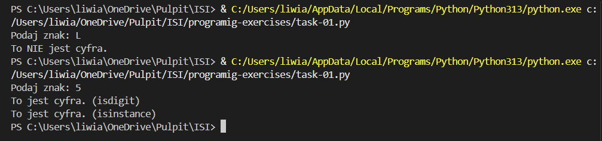

## TASK-01

**Treść zadania:**

> Program sprawdza, czy wczytany pojedynczy znak jest cyfrą. Jeśli wczytamy więcej znaków, bierze tylko pierwszy.
Hint: skorzystaj z funkcji isdigit() i isinstance().

**Plik z rozwiązaniem:** [skrypt01-25086.py](./skrypt01-25086.py)

**Zrzut ekranu:**

## TASK-02

**Treść zadania:**

> Napisz program, który sprawdza czy wczytany łańcuch znakowy jest liczbą lub nie. Muszą być wczytane co najmniej dwa znaki.
Hint: skorzystaj z funkcji all().

**Plik z rozwiązaniem:** [skrypt02-25086.py](./skrypt02-25086.py)

**Zrzut ekranu:**

## TASK-03

**Treść zadania:**

> Napisz program, który szuka określonego ciągu znaków w łańcuchu znakowym i zwraca indeks pierwszego wystąpienia ciągu lub -1, gdy nie ma takiego ciągu.
Hint: skorzystaj z funkcji find().

**Plik z rozwiązaniem:** [skrypt03-25086.py](./skrypt03-25086.py)

**Zrzut ekranu:**

## TASK-04

**Treść zadania:**

> Napisz program, który szuka określonego ciągu znaków w łańcuchu znakowym i zwraca indeksy wszystkich wystąpień ciągu lub -1, gdy nie ma takiego ciągu.
Hint: skorzystaj z funkcji split().

**Plik z rozwiązaniem:** [skrypt04-25086.py](./skrypt04-25086.py)

**Zrzut ekranu:**

## TASK-05

**Treść zadania:**  

> Napisz program (na dwa sposoby), który szuka pierwiastków liczb od 1 do 256 (włącznie) podzielnych bez reszty przez 2.  
Hint: skorzystaj z modułu math i z tzw. 'list comprehensions'.  

**Plik z rozwiązaniem:** [skrypt05-25086.py](./skrypt05-25086.py)

**Zrzut ekranu – Sposób 1:**

**Zrzut ekranu – Sposób 2:**

## TASK-06

**Treść zadania:**

> Napisz program, który tworzy słownik o nazwie zawierającej Twój numer albumu.
Kluczami powinny być liczby od 10 do 20, a wartościami pseudolosowe łańcuch znaków o długości 8.
Hint: skorzystaj z modułów string i random.

**Plik z rozwiązaniem:** [skrypt06-25086.py](./skrypt06-25086.py)

**Zrzut ekranu:**

## TASK-07

**Treść zadania:**

> Stwórz folder utils, a w nim plik 'obliczenia.py', w którym należy zaimplementować cztery wybrane funkcje matematyczne z modułu math.
Następnie należy utworzyć plik skrypt7-nr_albumu.py i zaimportować w nim ww. funkcje do obliczeń na przykładowych wartościach.

**Plik z rozwiązaniem:** [skrypt07_25086.py](./skrypt07_25086.py) [obliczenia.py](./utils/obliczenia.py)

**Zrzut ekranu:**

## TASK-08

**Treść zadania:**

> Napisz program, który generuje losowy ciąg znaków o długości 100, a następnie utwórz słownik którego kluczami będą unikalne znaki występujące w ciągu, a wartościami liczba ich wystąpień w ciągu znakowym. Utwórz listę, której każdy element to krotka (tupla), zawierająca kolejny klucz z ww. słownika i odpowiadającą mu wartość liczbową.
Hint: skorzystaj z modułu collections i klasy Counter().

**Plik z rozwiązaniem:** [skrypt08-25086.py](./skrypt08-25086.py)

**Zrzut ekranu:**

## TASK-09

**Treść zadania:**

> Stwórz klasy Vehicle i Car z polami nazwa, rok_produkcji i przebieg oraz metodami is_old() i is_long_mileage(). Stwórz po jednym obiekcie dla każdej z klas oraz trzeci obiekt, gdzie klasa Car dziedziczy z klasy Vehicle. Dla każdego z obiektów wywołaj obie metody, co najmniej raz użyj dekoratora @property w każdym z trzech przypadków.

**Plik z rozwiązaniem:** [skrypt09-25086.py](./skrypt09-25086.py)

**Zrzut ekranu:**

## TASK-10

**Treść zadania:**

> Napisz program, który korzystająć z metody chr() wygeneruje łańcuch znakowy z alfabetem, czyli 'abc....xyz'. Do pliku alfabet1-numeralbumu.txt zapisz wygenerowany łańcuch znakowy, a do pliku alfabet2-numeralbumu.txt zapisz litery z ww. łańcucha znakowego, tylko że każda litera ma się znaleźć w osobnej linii w pliku.
Hint: oprócz funkcji write() skorzystaj również z menadżera kontekstu with, żeby nie zapomnieć o zamknięciu pliku.

**Plik z rozwiązaniem:** [skrypt10-25086.py](./skrypt10-25086.py)

**Zrzut ekranu:**

**Zrzut ekranu:**

## TASK-11

**Treść zadania:**

> Odwrócić sentencję podaną przez użytkownika.

**Plik z rozwiązaniem:** [skrypt11-25086.py](./skrypt11-25086.py)

**Zrzut ekranu:**

## TASK-12

**Treść zadania:**

> Zamienić wszystkie litery o na 0, e na 3, i na 1, a na 4 w podanej przez użytkownika sentencji.

**Plik z rozwiązaniem:** [skrypt12-25086.py](./skrypt12-25086.py)

**Zrzut ekranu:**

## TASK-13

**Treść zadania:**

> Używając pętli wyświetl liczby w przedziale od 1 do 50 oprócz liczb podzielnych przez 3.

**Plik z rozwiązaniem:** [skrypt13-25086.py](./skrypt13-25086.py)

**Zrzut ekranu:**

## TASK-14

**Treść zadania:**  

> Używając pętli dodaj do wcześniej zadeklarowanej tabeli liczby z przedziału 1-100, które są podzielne przez 3 i 4.

**Plik z rozwiązaniem:** [skrypt14-25086.py](./skrypt14-25086.py)

**Zrzut ekranu:**

## TASK-15

**Treść zadania:** 

> Używając pętli dodaj do wcześniej zadeklarowanej tabeli liczby z przedziału 1-100, które są podzielne przez 3 lub 5.

**Plik z rozwiązaniem:** [skrypt15-25086.py](./skrypt15-25086.py)

**Zrzut ekranu:**

## TASK-16

**Treść zadania:**

> Napisz funkcję `potega()`, która podnosi podaną liczbę do trzeciej potęgi.

**Plik z rozwiązaniem:** [skrypt16-25086.py](./skrypt16-25086.py)

**Zrzut ekranu:**

## TASK-17

**Treść zadania:** 

> Stwórz klasę o nazwie Dog, która będzie posiadała zmienne takie jak: name, age, coat_color. Dodatkowo klasa posiada funkcje sound(), po wywołaniu której wypisywany jest tekst: {name} is barking! Stworzyć 3 obiekty klasy Dog.

**Plik z rozwiązaniem:** [skrypt17-25086.py](./skrypt17-25086.py)

**Zrzut ekranu:**

## TASK-18

**Treść zadania:** 

> Stworzyć plik funkcje.py, w którym należy zaimplementować funkcję: dodawanie, odejmowanie, dzielenie, mnożenie oraz modulo. W pliku main.py zaimportować plik funkcje.py i wykorzystać zaimportowane funkcje na przykładowych wartościach.

**Plik z rozwiązaniem:** [funkcje.py](./funkcje.py)[main.py](./main.py)

**Zrzut ekranu:**

## TASK-19

**Treść zadania:** 

> Sprawdź czy wyraz bądź zdanie podane przez użytkownika jest palindromem.

**Plik z rozwiązaniem:** [skrypt19-25086.py](./skrypt19-25086.py)

**Zrzut ekranu:**

## TASK-20

**Treść zadania:**  

> Prosta gra, program generuje losową liczbę od 1 do 100, użytkownik ma odgadnąć liczbę, jeżeli nie trafi ma zostać wyświetlona podpowiedź czy za duża czy za mała liczba.

**Plik z rozwiązaniem:** [skrypt20-25086.py](./skrypt20-25086.py)

**Zrzut ekranu:**

## TASK-21

**Treść zadania:**  

> Dziedziczenie klas. Klasa Animal ma zawierać atrybuty takie jak name, age, sex oraz metodę sound(). Klasy Dog, Cat oraz Fox dziedziczą po klasie Animal oraz nadpisują funkcje sound() odpowiednimi dźwiękami, dodatkowo klasy Dog oraz Cat posiadają atrybut breed.

**Plik z rozwiązaniem:** [skrypt21-25086.py](./skrypt21-25086.py)

**Zrzut ekranu:**

## TASK-22

**Treść zadania:**  

> Należy wykorzystać plik wordlist_10000.txt i stworzyć funkcję wyszukującą najdłuższy wyraz w tym pliku oraz drugą funkcję, która wyszuka wyrazy o długości 10.

**Plik z rozwiązaniem:** [skrypt22-25086.py](./skrypt22-25086.py)

**Zrzut ekranu:**

## TASK-23

**Treść zadania:**  

> Za pomocą pętli stworzyć 1000 losowych 6 znakowych wyrazów [A-Z][a-z][0-9] i zapisać je do pliku passwords.txt.

**Plik z rozwiązaniem:** [skrypt23-25086.py](./skrypt23-25086.py)

**Zrzut ekranu:**

**Zrzut ekranu:**

## TASK-24

**Treść zadania:**  

> Napisać funkcję tworzącą plik pc.csv. Pierwszy wiersz ma zawierać nazwy kolumn: pc_name, ip. Nazwy komputerów mają zaczynać się literą P oraz 4 oktetem adresu ip. Adresy zaczynają się od 172.30.2.1 do 172.30.2.100. Plik csv ma być rozdzielany przecinkami.

**Plik z rozwiązaniem:** [skrypt24-25086.py](./skrypt24-25086.py)

**Zrzut ekranu:**

**Zrzut ekranu:**

## TASK-25

**Treść zadania:**  

> Za pomocą pakietu do web-scrappingu, np.beautifulsoup lub jsoup, zapisać do tablicy wszystkie hiperłącza występujące na wybranej przez siebie stronie.

**Plik z rozwiązaniem:** [skrypt25-25086.py](./skrypt25-25086.py)

**Zrzut ekranu:**

## TASK-26

**Treść zadania:**  

> Za pomocą pakietu do web-scrappingu, np.beautifulsoup lub jsoup, zapisać do tablicy wszystkie hiperłącza występujące na wybranej przez siebie stronie.

**Plik z rozwiązaniem:** [skrypt26-25086.py](./skrypt26-25086.py)

**Zrzut ekranu:**

