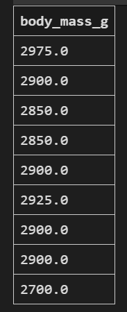

# EXCERCISE-01

> Write a SQL query to select the sex and body mass columns from the little_penguins in that order, sorted such that the largest body mass appears first.

``` 
SELECT sex,body_mass_g FROM little_penguins 
ORDER BY body_mass_g DESC
```


# EXCERCISE-02

> Write a SQL query to select the islands and species from rows 50 to 60 inclusive of the penguins table. Your result should have 11 rows.

``` 
SELECT  species, island FROM penguins
limit 11
OFFSET 49
```


# EXCERCISE-03

> Modify your query to select distinct combinations of island and species from the same rows and compare the result to what you got in part 1.

``` 
SELECT DISTINCT species, island FROM (
SELECT species, island FROM penguins
limit 11
OFFSET 49
)

```


# EXCERCISE-04

> Write a query to select the body masses from penguins that are less than 3000.0 grams.

``` 
SELECT body_mass_g FROM penguins 
WHERE body_mass_g < 3000


```



# EXCERCISE-05

> Write another query to select the species and sex of penguins that weight less than 3000.0 grams. This shows that the columns displayed and those used in filtering are independent of each other.

``` 
SELECT species, sex FROM penguins 
WHERE body_mass_g < 3000

```


# EXCERCISE-06
> Use the not operator to select penguins that are not Gentoos.

```
SELECT * FROM penguins 
WHERE species != "Gentoo"
```


